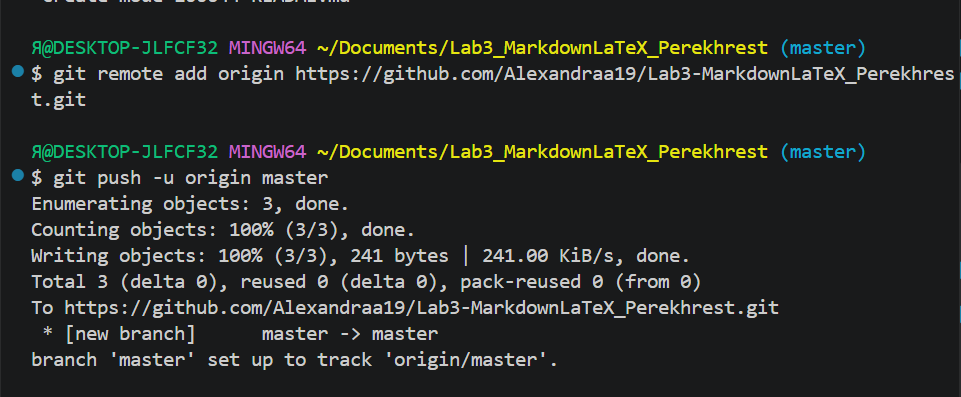

# Лабораторная работа №3. Работа с Markdown-разметкой и базовое использование LaTeX в документации проекта

## Краткое описание
Данная лабораторная работа посвящена изучению возможностей Markdown-разметки и базовому использованию LaTeX в документации проекта. В ходе работы были созданы структура проекта, настроен Git-репозиторий, изучены основные элементы Markdown: заголовки, списки, таблицы, блоки кода, ссылки, изображения. Также освоены дополнительные возможности - чекбоксы, сноски, alert-блоки и математические формулы LaTeX.
## Содержание

- [Структура проекта](#структура-проекта)
- [Markdown-элементы](#markdown-элементы)
  - [Форматирование текста](#форматирование-текста)
  - [Списки](#списки)
  - [Таблица](#таблица)
- [LaTeX в Markdown](#latex-в-markdown)
- [Итог](#итог)

---

## Структура проекта

- `README.md` — основной файл документации проекта
- `docs/` — Markdown-файлы с примерами
  - `ReadmePushLab3_Perekhrest.md` — описание пуша
  - `headersLab3_Perekhrest.md` — заголовки
  - `separatorsLab3_Perekhrest.md` — горизонтальные линии
  - `formattingLab3_Perekhrest.md` — форматирование текста
  - `listsLab3_Perekhrest.md` — списки
  - `linksImagesLab3_Perekhrest.md` — ссылки и изображения
  - `codeQuotesLab3_Perekhrest.md` — блоки кода и цитаты
  - `tablesLab3_Perekhrest.md` — таблицы
  - `advancedMarkdownLab3_Perekhrest.md` — дополнительные возможности
  - `latexLab3_Perekhrest.md` — LaTeX-формулы
- `img/` — скриншоты выполнения заданий
- `latex/` — примеры формул

---

## Markdown-элементы

### Форматирование текста

**Полужирный текст**, *курсив*, ***полужирный курсив***, ~~зачёркнутый~~, `моноширный`.

### Списки

- Маркированный пункт
- Ещё один пункт
  - Вложенный подпункт
  - Ещё один подпункт

1. Нумерованный пункт
2. Второй пункт
3. Третий пункт

### Таблица

| Функция | Команда Git | Описание |
|:--------|:-----------:|---------:|
| Создание репозитория | `git init` | Инициализация репозитория |
| Просмотр состояния | `git status` | Показывает изменённые файлы |
| Отправка на GitHub | `git push` | Загружает коммиты на сервер |

### Цитата

> Markdown -это лёгкий язык разметки, который используется для оформления README-файлов, документации и отчётов.

### Блок кода

```csharp
string name;
name = Console.ReadLine();
Console.WriteLine(name);
```

### Изображение



### Ссылка

Внешняя ссылка: [GitHub](https://github.com)

Внутренняя ссылка: [вернуться к содержанию](#содержание)

### Чекбоксы

- [x] Task 1 — изучить Markdown
- [x] Task 2 — освоить LaTeX
- [ ] Task 3 — оформить README

### Сноска

Markdown полезен в разработке[^1].

[^1]: Markdown — лёгкий язык разметки, широко применяемый в документации проектов.

### Alert-блоки

> [!NOTE]
> Это заметка — простая информация для сведения.

> [!TIP]
> Это совет — как сделать что-то удобнее.

> [!WARNING]
> Это предупреждение — на что стоит обратить внимание.

---

## LaTeX в Markdown

### Inline LaTeX

Площадь круга: $S = \pi r^2$

Формула Эйнштейна: $E = mc^2$

### Block LaTeX

$$
\sum_{i=1}^n i = \frac{(n+1)}{2}
$$

$$
\int_0^\infty e^{-x^2} dx = \frac{\sqrt{\pi}}{2}
$$

---

## Итог

В ходе лабораторной работы были изучены и применены на практике:

- Основы Markdown-разметки: заголовки, списки, таблицы, ссылки, изображения, блоки кода.
- Дополнительные возможности: чекбоксы, сноски, GitHub Alert-блоки, escape-символы, встроенный HTML.
- Базовое использование LaTeX для оформления математических формул: inline и block.
- Работа с Git: инициализация репозитория, коммиты, пуш на GitHub.