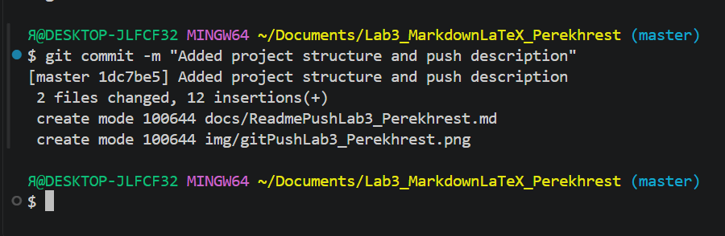

# Ссылки и изображения в Markdown

## Обычные ссылки

[GitHub](https://github.com)

[Официальный сайт Markdown](https://www.markdownguide.org/)

[Visual Studio Code](https://code.visualstudio.com/)

## Ссылка с подсказкой

[Markdown Guide](https://www.markdownguide.org/ "Перейти на официальный сайт")

## Изображения

